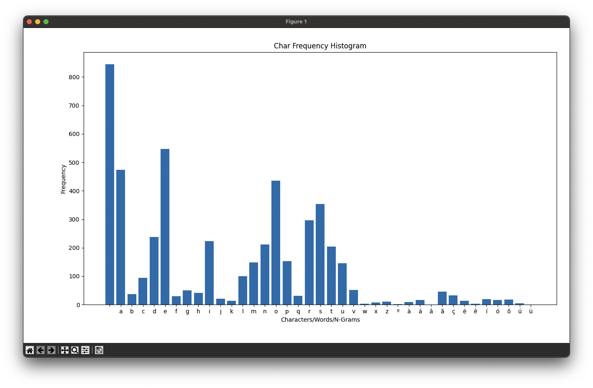
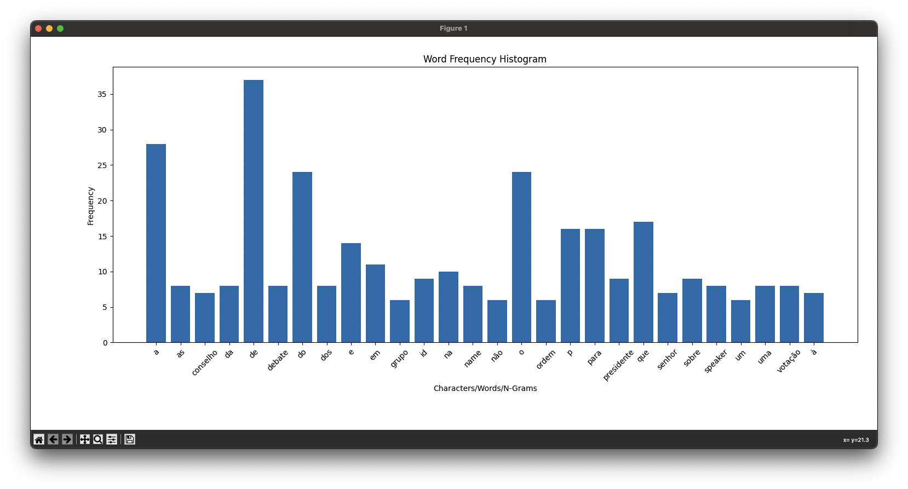
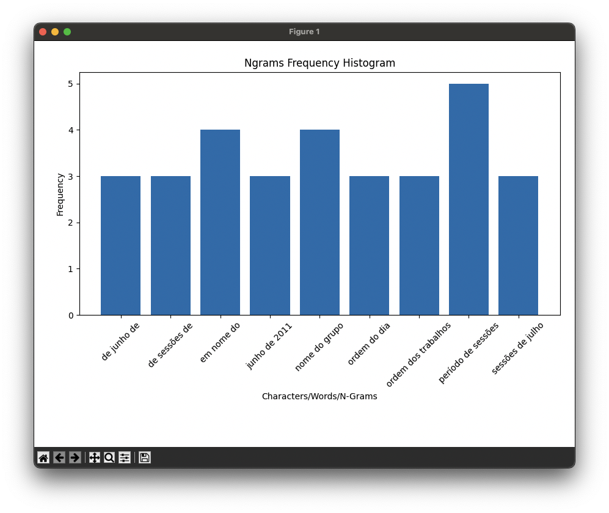

# IC - Information and Coding (2024/25)

---
# PROJECT 1 : Part I
<p style="text-align: right;"><strong>Author:</strong> Inês Águia</p>

- **Installing Boost.locale** (to work with UTF-8 encoding)
```bash
#macOs:
    brew install boost
#Linux:
    sudo apt-get update
    sudo apt-get install libboost-all-dev
#Windows:
    Download the Boost libraries from Boost's official website
```

- **Build and Run**
    ```bash
    mkdir build
    cd build
    cmake ..
    make
    ./TextDecoder
    ```

### Navigation selection
In order to transform the option selection be more easy do understand we adopt a grammar-like structure:

```java
COMMAND	    :	arg ("-display")*
		    |	"-charFreq" arg 
		    |	"-wordFreq" arg
		    |	"-nGrams" NUM arg
                    |   "-hist" ("-charFreq" arg | "-wordFreq" arg | "-nGrams" NUM arg)
		    ;

arg		    :	"-load" TEXT ("-lower")* ("-punct")* ("-num")*
            ;

TEXT	    :	path_to_text 
            ;

NUM         :	[0 9]+
            ;	   
```
1. **COMMAND:**
A command can be:
    - `arg` --> *[simple|altered]* file, optionally followed by `-display`
    - `-charFreq` ***arg*** --> Calculate and display char frequency of *[simple|altered]* file
    - `-wordFreq` ***arg*** --> Calculate and display word frequency of *[simple|altered]* file
    - `-nGrams` ***NUM*** ***arg*** --> Calculate and display the *NUM* grams frequency of *[simple|altered]* file
    - `-hist` (`-charFreq` arg | `-wordFreq` arg | `-nGrams` NUM arg) --> Display the histogram of a chosen frequency(*char, word, nGram*) distribution of *[simple|altered]* file

2. **arg:**
    - `-load` ***TEXT*** --> load the *text file*
    - <u>Optionally</u>, following operations can be applied to the loaded text file **in whatever order wanted**:
        - `-lower` -->  Conversion to Lower Case
        - `-punct` -->  Removing all the punctuation
        - `-num` -->  Removing all the numbers

3. **IMAGE:**
    - ***Path*** where the text file is stored.

4. **NUM:**
    - ***Integer*** value.

## COMMAND EXAMPLES:

1. **Load and Display a file**
    ```bash
    ./TextDecoder -load ../../../datasets/text/pt/ep-11-06-22-011.txt -display
    ```
2. **Load a File, Convert to Lowercase, and Display**
    ```bash
    ./TextDecoder -load ../../../datasets/text/pt/ep-11-06-22-011.txt -lower -display
    ```
3. **Load a File, Convert to Lowercase, Remove Punctuation, and Display**
    ```bash
    ./TextDecoder -load ../../../datasets/text/pt/ep-11-06-22-011.txt -lower -punct -display
    ```
4. **Load a File and Calculate Character Frequency**
    ```bash
    ./TextDecoder -charFreq -load ../../../datasets/text/pt/ep-11-06-22-011.txt 
    ```

---
---

<br>

# Relevant Information:

### **Introduction:**
***Part I*** consists of text manipulation, the program must be able to read, process, and analyze text files. 
The main objectives include reading and storing text content while normalizing the text by converting it to lowercase and removing punctuation, 
and calculating character and word frequencies to understand their distribution within the text. Optional features include handling different encodings (e.g., UTF-8)
supporting non-ASCII encodings and calculating n-grams for deeper analysis. 

I opted to include here some of the information I gathered while developing certain tasks within this part
that helped me better understand the best way to achieve our goal.

---

<br>

### **UTF-8 Encoding Structure**:
---
- **1 byte (7 bits)**: <br>
`ASCII` chars, the first 128 Unicode code points *[U+0000 to U+007F]*.  <br>
Includes: 
    - letters (A-Z, a-z) 
    - digits (0-9)
    - punctuation
    - control chars 
    ```java 
    Example:
        'A' (Unicode U+0041) → 01000001 (1 byte)
    ```

- **2 bytes (11 bits)**: <br>
For chars with code points *[U+0080 to U+07FF]*.  <br>
Includes: 
    - accented Latin chars
    - chars from various other scripts. 
    ```java
    Example:
        'é' (Unicode U+00E9) → 11000011 10101001 (2 bytes)
    ```

- **3 bytes (16 bits)**:  <br>
For chars with code points *[U+0800 to U+FFFF]*. <br>
Includes:
    - Asian chars and symbols
    ```java
    Example:
        'ह' (Devanagari character, Unicode U+0939) → 11100000 10100100 10011001 (3 bytes)
    ```

- **4 bytes (21 bits)**:  <br>
For characters with code points *[U+10000 to U+10FFFF]*. <br>
Includes: 
    - various historic chars
    - emoji
    - symbols
    ```java
    Example:
        '𝄞' (musical symbol G clef, Unicode U+1D11E) → 11110000 10011101 10000100 10111110 (4 bytes)
    ```
<br>

The ***<u>first byte of a UTF-8 sequence</u>*** tells you how many bytes the character occupies:
- **1 byte** --> `0xxxxxxx`
- **2 bytes** -> `110xxxxx`
- **3 bytes** -> `1110xxxx`
- **4 bytes** -> `11110xxx`

---

<br>

### Loading File
---
1. **Read file in binary mode:** To ensure we capture the raw bytes
2. **Determine how many bytes each UTF-8 char occupies:** Handle multi-byte chars<br>
    We get the first byte and check if it is between the range we expect:
    - 1 byte_ `0xxxxxxx` -> range from `00000000` to `011111111` (0 to 127)
    - 2 bytes `110xxxxx` -> range from `11000000` to `11011111` (192 to 223)
    - 3 bytes `1110xxxx` -> range from `11100000` to `11101111` (224 to 239)
    - 4 bytes `11100xxx` -> range from `11100000` to `11100111` (240 to 247)
    
    ```c++
    int TextFileReader::utf8CharBytes(unsigned char byte) {
        if (byte < 0x80) {          // 1-byte ASCII(0 to 127) -> if byte < 128(0x80)
            return 1;
        } else if (byte < 0xE0) {   // 2-byte UTF-8 char(192 to 223) -> if byte < 224(0xE0)
            return 2;
        } else if (byte < 0xF0) {   // 3-byte UTF-8 char(224 to 239) -> if byte < 240(0xF0)
            return 3;
        } else {                    // 4-byte UTF-8 char(240 to 247) -> if byte >= 240
            return 4;
        }
    }
    ```
    After this depending on the calculated number, we join the bytes in a *string* to make a *multi-byte char*.
3. **Store the result:**  in the appropriate structure for further processing

    ```math
    \text{map<string, list<vector<string>>>} \Leftrightarrow \text{map<fileName, list<vector<lines>>>}
    ```

    To store the file name and all the lines of that file, allowing various files to be added to this structure.
---

<br>

### Converting to Lower Case
---
1. **PROBLEM**:
- Inicially we only converted the ASCII chars to $lowercase$ and we get something like this:
    ```plaintext
        Inês Águia ---> converting to lowercase --> inês Águia 
    ``` 
    As can be seen the non-ASCII chars were not converted to lower case.
2. **SOLUTION**:
- There is no simple pattern to convert $uppercase$ to $lowercase$, except for the ASCII chars.
- Boost.locale:
    1. Set the variabel locale to UTF-8
    ```c++
        locale::global(boost::locale::generator().generate("en_US.UTF-8"));
    ``` 
    - In `en_GB.UTF-8` : 
        - **en** : language
        - **US** : Country/Region
        - **UTF-8** : character encoding <br>
        - there is a great number of different combinations: 
            - `locale -a` to see them all
    - for example when working with ***GREEK*** language the lower case has two forms depending on the position of the letter in the word.
        - **Σ** (sigma) :
            - **σ** : Used when it's in the middle of a word.
            - **ς** : Used when it's at the end of a word.
        - So we can use this to make the ***Boost.locale*** more precise depending on the language we are working with.
    - there are other things altered by this:
        - currency (`£` or `€` - pound sterling or EURO)
        - number formating (`1 000,00` instead of `1,000.00`)
        - text direction (Hebrew is `RTL` - right to left) 
        - spelling differences ( `colour` instead of `color`)
        - Date (`DD/MM/YYYY` instead of `MM/DD/YYYY`)


    2. Convert char by char:
    ```c++
        for (auto& line : fileContents[fileName]) {
            for (auto& utf8Char : line) {
                // Convert the character to lowercase
                utf8Char = boost::locale::to_lower(utf8Char);  
            }
        }
    ``` 

3. **LIMITATIONS**
- Using `en_US.UTF-8` we can convert all the basic european languages (English, French, German, Spanish) is the most maintainf *locale*. 
- The following ones are the exception since they have specific rules:
    - Greek
    - Turkish 
    - Eastern Europe ( Czech, Polish, etc..)
    - Arabic languages  

### After this solution the result
```
    Inês Águia ---> ines águia
```
---

<br>

### Removing Punctuation
---
In the first run I only removed punctuation and got the following:
    
```plaitext
    NAME="Hannes Swoboda"> ---> remove punctuation ---> NAMEHannes Swoboda
```
- **PROBLEM**
    - This is a mistake... because we were removing the punctuation only, and doing so we only ended combining words.
    `NAMEHannes` and not `NAME Hannes`
- **SOLUTION**
    1. **Switch punctuation with `' '`** (space)
        - But this creates another problem... we got a lot of duplicate, triplicated, ... `' '` (space)
    2. **Remove duplicated `' '`**
        - We had to look for duplicated `' '`(space) and remove them
    ```plaitext
        NAME="Hannes Swoboda"> ---> remove punctuation(with all problems solved) ---> NAME Hannes Swoboda
    ```
---

<br>

### CHAR Frequency
---
To calculate the char frequency we ran the structure for each FileName.
Each line is an array, and for each position we get the char and added it to a Map if it does not exist with a value representing the occurence. If exists we simply increment it. 

```
With this approuch we can generate the char frequency with or without alterations/filters like (-punct, -lower and -num)
```
### Console display

```bash
 Frequency : Char/Word/Expression 
-----------------------------------
   760     :  
   501     : e
   439     : a
   423     : o
   338     : s
   281     : r
   224     : d
   211     : i
   201     : t
   194     : n
   141     : m
   141     : u
   104     : p
    96     : l
    75     : c
    49     : P
    48     : v
    47     : .
    46     : E
    46     : ã
    38     : ,
    37     : b
    37     : h
    36     : "
    35     : g
    34     : A
    33     : ç
    30     : q
    25     : >
    25     : <
    23     : f
```
`./TextDecoder -charFreq -load ../../../datasets/text/pt/ep-11-06-22-011.txt `

```bash
    # NOTE
    As you can see in the following table header:

        Frequency : Char/Word/Expression
    
    We have : char/word/Expression, because we developed a function to mount the console display in order to reuse it to the following function to calculate frequencies.
```

<br>

### WORDS Frequency
---
Here we have a similar approach to the one in the Char Frequency, we added the words to a Map and counted the frequency of occurency for each word.

To get the words, we ran each array and defined **word** as a group of adjunt position with `' '` in both ends.

```bash
 Frequency : Char/Word/Expression 
-----------------------------------
    35     : de
    24     : do
    23     : a
    17     : que
    17     : o
    16     : para
    16     : P
    14     : e
    11     : em
     9     : ID
     9     : sobre
     9     : na
     9     : Presidente
     8     : votação
     8     : SPEAKER
     8     : dos
     8     : NAME
     8     : da
     8     : uma
     8     : debate
     7     : Conselho
     7     : O
     7     : as
     7     : à
     6     : Grupo
     6     : um
     5     : ordem
     5     : período
```
`./TextDecoder -wordFreq -load ../../../datasets/text/pt/ep-11-06-22-011.txt -punct`


<br>

### nGRAMS Frequency
---
Here we needed to get the nGrams, and n is defined by the user. 
1. We normalized the text:
    - removePunctuation(fileName);
    - convertToLowercase(fileName);
2. We tokenized the text
    - convert the text in words
3. Generate the nGrams with the words.

```bash
 Frequency : Char/Word/Expression 
-----------------------------------
     5     : período de sessões
     4     : em nome do
     4     : nome do grupo
     3     : de junho de
     3     : de sessões de
     3     : junho de 2011
     3     : sessões de julho
     3     : ordem do dia
     3     : ordem dos trabalhos
     2     : a situação na
     2     : adiamento do debate
     2     : para os nossos
     2     : para o período
     2     : para o euro
     2     : realizar um debate
     2     : relatório do senhor
     2     : o período de
     2     : o debate sobre
     2     : situação na rússia
     2     : sobre esta matéria
     2     : sobre governação económica
     2     : e da votação
     2     : do senhor deputado
     2     : do projecto de
     2     : do grupo ppe
     2     : do debate e
     2     : definitiva do projecto
     2     : debate e da
     2     : sólidos para o
     2     : de senhor presidente
     2     : de ordem do
     2     : versão definitiva do
     2     : conferência dos presidentes
     2     : com o conselho
     2     : alicerces sólidos para
     2     : projecto de ordem
     1     : kastler sobre o
     1     : último período de
     1     : a resistir a
     1     : a segunda questão
     1     : a senhora deputada
```
`./TextDecoder -nGrams 3 -load ../../../datasets/text/pt/ep-11-06-22-011.txt `

<br>

### Print Function
---
As we said before we created a function to print all the Frequencies charts.

This function receives as argument the **sorted Map** of the frequencies.
We decided to sort the Map before printing because with this we can see the results in a descendent order from the **most occurrent to the least**, making it more readable.  

```bash
# nGram
 Frequency : Char/Word/Expression 
-----------------------------------
     5     : período de sessões
     4     : em nome do
     4     : nome do grupo

# Word
 Frequency : Char/Word/Expression 
-----------------------------------
    35     : de
    24     : do
    23     : a
    17     : que
    17     : o
    16     : para

# Char
 Frequency : Char/Word/Expression 
-----------------------------------
   760     :  
   501     : e
   439     : a
   423     : o
```

<br>

### HISTOGRAM
---
We made a python script to plot the histogram as asked. 

But we got some barely readable histograms, and to turn them more readable with defined some thresholds:
- **chars** :
    - Appear all the values( from 0 to $ \infty $)
    - In order to analyse the chars only, we have to develop a new function to remove the number, as we will talk later on

    | Histogram of Char Frequencies (ep-11-06-22-011.txt) |
    |-------------------------------|
    |  |
    | `./TextDecoder -hist -charFreq -load ../../../datasets/text/pt/ep-11-06-22-011.txt -lower -punct` |

- **words** :
    - Appear only words which frequency is above 5 

    | Histogram of Word Frequencies (ep-11-06-22-011.txt) |
    |-------------------------------|
    |  |
    | `./TextDecoder -hist -wordFreq -load ../../../datasets/text/pt/ep-11-06-22-011.txt -lower -punct` |

- **nGrams** :
    - Appear only the ngrams which frequency is above 2
    
    | Histogram of 3Grams Frequencies (ep-11-06-22-011.txt) |
    |-------------------------------|
    |  |
    | `./TextDecoder -hist -nGrams 3 -load ../../../datasets/text/pt/ep-11-06-22-011.txt -lower -punct` |

<br>

### Removing Numbers
---
We aditionally created a function to remove the numbers:
- This gave us the possibility to analyse the stats about chars (letters) not having in consideration the numbers. 

---
