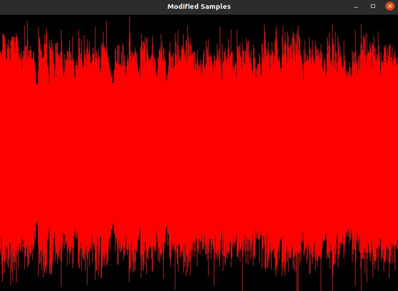

# IC - Information and Coding (2024/25)

Return to the main README : [Project 1 - README](../../project1/readme.md)
--
# PROJECT 1 : Part II
Author: João Oliveira

- **Installing SFML** 
```bash
#macOs:
    Dowload the files from the SFML website, the cmake file will locate it 
#Linux:
    sudo apt-get update
    sudo apt-get install libsfml-dev
#Windows:
    Download the files directly from the SFML website
```

- **Build and Run**
    ```bash
    mkdir build
    cd build
    cmake ..
    make
    ```
    Then, choose what action you want to perfrom and run the respective command.
    
    The commands to run the program are executed according to the following structure:
    ```bash
    ./SoundDecoder option fileName [quantizationLevels || noiselevel]
    ```
    Where option is the intended operation and the quantizationLevels / noiseLevels are optional.

    Examples:
    <br>
    Get audio file details:
    
    ```bash
    ./SoundDecoder details ../../../datasets/audio/sample01.wav
    ```

    Get audio file waveform:

    ```bash
    ./SoundDecoder waveform ../../../datasets/audio/sample01.wav
    ```

    Get audio file histogram:

    ```bash
    ./SoundDecoder histogram ../../../datasets/audio/sample01.wav
    ```

    Quantize and compare audio:
    
    ```bash
    ./SoundDecoder quantize ../../../datasets/audio/sample01.wav 45
    ```

    Quantize and play audio:

    ```bash
    ./SoundDecoder qzPlay ../../../datasets/audio/sample01.wav 45
    ```

    Quantize and show MSE:

    ```bash
    ./SoundDecoder MSE ../../../datasets/audio/sample01.wav 45
    ```

    Quantize and show SNR:

    ```bash
    ./SoundDecoder SNR ../../../datasets/audio/sample01.wav 45
    ```

    Add noise to audio samples and compare:

    ```bash
    ./SoundDecoder noiseWave ../../../datasets/audio/sample01.wav 15000
    ```

    Add noise to audio samples and play them:

    ```bash
    ./SoundDecoder noisePlay ../../../datasets/audio/sample01.wav 15000
    ```
    
    In any of these examples, you may replace "sample01.wav" with whichever file you want, "45" with however many quantization levels you want and "15000" with the amount of noise you want to add.
## **Audio with SFML**
Sfml is a library that allows us to maipulate audio in a number of ways.
```md
    buffer.loadFromFile(filename) ->load the audio file
    sound.setBuffer(buffer)
    sound.play() ->play the sound
```
### **Raw audio data**
Sfml contains a variety of functions to extract the raw data from an audio file.
```md
    buffer.getSamples() -> gives us a pointer to an array with the samples that make up the audio file
    buffer.getSampleCount() -> gives us the number of samples
    buffer.getSampleRate() -> gives us the number of samples per second
    buffer.getChannelCount() ->gives us the number of channesl (ex. 1 is mono, 2 is stereo)
```

## **Waveforms**
The waveform of an audio file represents how the different amplitude values change along the length of the file. We must be carefull however, in the samples array half the samples belong to the right channel and the other half belong to the left channel (for stereo audio), so we must skip every other sample.
```md
    for (std::size_t i = 0; i < sampleCount; i += channelCount) 
```

To draw the waveform, we used the sfml sf::VertexArray with the sf::LineStrip property to draw lines based on the amplitude values.

<p align="center">
        
    <p align="center">
    Example of a wavefile being displayed


## **Histogram**

- **MID Channel:**
    In audio processing, the MID channel represents the sound that is common between both left and right channels (mono audio). We can calculate it in the following manner:

    $$
        MID = \frac{L+R}{2}
    $$

    With L being the left channel and R being the right channel. By caclulating the average between the two, we can see the similarities between both channels.
    Here we can see the distribution of the amplitude values of this channel through a histogram.

    <p align="center">
        
    <p align="center">
    Histogram of amplitude values for the Sample01.wav file
    
<br>

- **SIDE Channel**
The SIDE channel on the other hand highlights the differences between the left and right channel.

$$
    SIDE = \frac{L-R}{2}
$$

This difference between channels is the essence of stereo audio.
The distribution of the amplitude values of this channel is as follows.

<p align="center">
    
<p align="center">
Histogram of amplitude values for the Sample01.wav file
    


## **Quantization**

Quantization is the process of reducing the number of bits needed to represent a piece of information. In terms of audio, this is done by reducing the number of different amplitude values needed to represent an audio signal. This will decresae the size of the required data, however, it will also result in loss of audio quality.
Quantization is done according to the following formula:

$$
    Q = round(\frac{x-xmin}{stepSize})*stepSize +  xmin
$$

In this formula, X is the amplitude value, xmin is the minimum amplitude value and stepSize is calculated as follows

$$
    S = \frac{xmax-xmin}{L}
$$
    <p align="center">
    With L being the quantization level.

There are two major types of quantization:
-  **Non unifrom quantization**: Where the quantization intervals are of different sizes. This allows us to allocate more levels to the most common values to lose less of the original information.

-  **Unifrom quantization**: Where the quantization intervals are all the same size. This is much easier to implement, however it introduces more error.

After quantizing an audio sample (through uniform quantization), we then compare it with the original by plotting the waveforms.

<p align="center">
    
<p align="center">
    Sample01.wav: orignal(top), and quantized (bottom)
    with a quantization level of 45

We can also run:

```bash
./SoundDecoder qzPlay ../../../datasets/audio/sample01.wav 45
```

To play the quantized audio and verify that, the lower the quantization level, the lower the audio quality becomes.
As was said, quantization aims to reduce the amount of bits needed to represent the audio, achieving this by reducing the amount of different amplitude levels. So, as we can see in the image above, the quantized waveform seems "blockier", this is because each vertical line represents a different amplitude value and, as is the goal of quantization, we reduced that number.
    

## **MSE**

The Mean Squared Error (MSE) is a metric used to qualify the difference between two signals by measuring the squared differences of the two signals.
It is calculated using the following formula:

$$
    \frac{\sum (x[i]-y[i])²}{N}
$$

<p align="center">
    Where x and y are the signals and N is the number of samples in the signal

We can use MSE to compare a quantized audio and it's original sample, calculating a metric to show us how different they are. The higher the MSE the more different the two samples are.

Using the command:
```bash
./SoundDecoder MSE ../../../datasets/audio/sample01.wav 45
```

We calculate that, the MSE for the file "sample01.wav" and it's quantized version with a quantization level of 45 is 176620.

Now, if we increase the quantization level to 55:
```bash
./SoundDecoder MSE ../../../datasets/audio/sample01.wav 55
```

We get and MSE value of 118407. This way we can confirm that, the more we decrease the number of levels when performing quantization, the more different the two signals become (by loss of information, as we stated above).

## **SNR**

The Signal to Noise Ration (SNR) is a metric that compares the level of the desired signal with the the level of background noise, measured in decibels (dB).
It is calculated according to the following formula:

$$
    SNR = 10 * log \frac{Psignal}{Pnoise}
$$
<p align="center">
    Where Psignal is the strength of the signal and Pnoise is the strength of the noise

We can calculate the strength of the signal the following way:

$$
    Psignal = \frac{\sum (x[i])²}{N}
$$

And we can use the MSE calculated previously as the power of the noise because, as was stated, MSE calculated the differences between the two samples, which is essentially, the noise.

Unlike in MSE, SNR, in a way, measures the similarities between the two samples (measuring how much of the orignal signal there still is compared to the noise). So in SNR (unlike MSE), a higher value indicates bigger similarities bewteen the two sounds.

We can repeat the steps we used in MSE to verify this.
By comparing the file "sample01.wav" with it's quantized version using 45 quantization levels:

```bash
./SoundDecoder SNR ../../../datasets/audio/sample01.wav 45
```

We get the value 19,3675.

Now, repating the process but increasing the quantization levels to 55:

```bash
./SoundDecoder SNR ../../../datasets/audio/sample01.wav 55
```

We get the value 21,1042. 
As we can see, a higher value indicates a more similar sound, as we expected by increasing the number of quantization levels.

## **Noise**

In audio processing, noise is an unwanted alteration of the audio samples, it drowns out the original audio and causes a lower audio quality in general.

In our work, we use a random number generator to generate a random amount of noise which we then add to our original samples. The noise level is the amount of noise we add to the audio, it can range from 0 to 32767 (32767 is the max range of the amplitude values). For a good test value, we recommend using a noise level ranging from 10000 to 15000, this way the noise is noticeable but not overwhelming.

By running
```bash
./SoundDecoder noiseWave ../../../datasets/audio/sample01.wav 15000
```
We can see how the noise affects the audio samples:

<p align="center">
    
<p align="center">
    Original samples

<p align="center">
    
<p align="center">
    "Noisy" samples

We can further verify how the audio quality is affected by listening to the noisy samples.
```bash
./SoundDecoder noisePlay ../../../datasets/audio/sample01.wav 15000
```
The loss of audio quality is quite evident when listening to it at higher noise levels.