# IC - Information and Coding (2024/25)

Return to the main README : [Project 1 - README](../../project1/readme.md)
---
# PROJECT 1 : Part III 
<p style="text-align: right;"><strong>Author:</strong> Pedro Carneiro</p>


### **1º** OpenCv installation

```md
# macOs:
    brew install opencv

# linux:
    sudo apt-get install libopencv-dev

# win:
    download from the website
```

### **2º** SetUp enviroment
In order to be easier to collaborate with others, **CMake** will handle the build configuration across different enviroments

- 2.1 : **Create a *CMakeLists.txt***
    ```md
        - find the OpenCv library installed on system;
        - pointing automatically to the correct include;
        - include all the OpenCv libraries

    
    cmake_minimum_required(VERSION 3.10)
    project(ImageDecoderProject)

    set(CMAKE_CXX_STANDARD 17)

    # Find OpenCV package
    find_package(OpenCV REQUIRED)

    # Include OpenCV directories
    include_directories(${OpenCV_INCLUDE_DIRS})

    # Add the executable and link libraries
    add_executable(ImageDecoder partIII.cpp ImageDecoder.cpp)
    target_link_libraries(ImageDecoder ${OpenCV_LIBS})
    ```

- 2.2 : **Build and Run**
    ```bash
        mkdir build
        cd build
        cmake ..
        make
        ./ImageDecoder
    ```


---
---
# Relevante Information:

### **Option selection**
To implement the command definition we adopted a grammar-like structure:
```java
COMMAND :   "-diff" arg "," arg  ("-display")* 
        |   "-mse" arg "," arg 
        |   "-psnr" arg "," arg
        |   arg ("-display")*
        |   "-hist" (arg | "-diff" arg "," arg )
        ;

arg     :    "-load" IMAGE ("-grayscale")* ("-gaussian" NUM NUM)* ("-quantization" NUM)* ("-channels")* ("-highPass")* ("-rotate" NUM)* ("-invert")* ("-contrast")*
        ;

IMAGE   :  path_to_image
        ; 

NUM     :    [0 9]+;

```
1. **COMMAND:**
A command can be:
    - `-diff` ***arg*** ***arg*** --> Absolute difference between two images *[simple|altered]*, optionally followed by `-display`
    - `-mse` ***arg*** ***arg*** --> Calculate the **MSE** between two images *[simple|altered]*
    - `-psnr` ***arg*** ***arg*** --> Calculate the **PSNR** between two images *[simple|altered]*
    - `arg` --> *[simple|altered]*, optionally followed by `-display`
    - `-hist` ***arg*** --> Display the histogram of a single image *[simple|altered]*

2. **arg:**
    - `-load` ***IMAGE*** --> load the *IMAGE*
    - <u>Optionally</u>, following operations can be applied to the loaded image **in whatever order wanted**:
        - `-grayscale` -->  Grayscale conversion
        - `-gaussian` ***NUM*** ***NUM*** --> Apply Gaussian-blur <***kernel size***> <***sigma***> 
        - `-quantization` ***NUM*** --> Quantize <***nº levels***>.
        - `-channels` --> show RGB channels values and the comparing with grayscale values
        - `-highPass` --> Apply a HighPass filter 
        - `-rotate` ***NUM*** --> Rotate the image < **$ \alpha º$**> 
        - `-invert` --> Invert the image colors
        - `-contrast`--> Contrast enhancement

3. **IMAGE:**
    - ***Path*** where the image is stored.

4. **NUM:**
    - ***Integer*** value.

## COMMAND EXAMPLES:

1. **Abs. differece between `image1` and `image1 -blured`**
```bash
./ImageDecoder -diff -load "../../../datasets/image/boat.ppm" , -load "../../../datasets/image/boat.ppm" -gaussian 5 1 -display
```
2. **Mean Squared Error between `image1 -highPass filter` and `image1 -quantized to 4bits`**
```bash
./ImageDecoder -mse -load "../../../datasets/image/girl.ppm" -highPass , -load "../../../datasets/image/girl.ppm" -quantization 4
```
3. **Peak Signal-to-Noise Ratio between `image1 -highPass filter` and `image1 -quantized to 4bits`**
```bash
./ImageDecoder -psnr -load "../../../datasets/image/girl.ppm" -highPass , -load "../../../datasets/image/girl.ppm" -quantization 4
```
4. **Display an `image -blured -quantized to 5bits`** 
```bash
./ImageDecoder -load "../../../datasets/image/boat.ppm" -grayscale -gaussian 5 1 -quantization 5 -display
```
5. **Histogram of an `image -grayscale -quantized to 5bits`**
```bash
./ImageDecoder -hist -load "../../../datasets/image/boat.ppm" -grayscale -quantization 5 
```
6. **Histogram of the matrix of absolute difference between `image1` and `image1 -highPass filter`**
```bash
./ImageDecoder -hist -diff -load "../../../datasets/image/boat.ppm" , -load "../../../datasets/image/boat.ppm" -highPass 
```

---
<br>

### **BGR (Blue,Green, Red)** :
---
when you load an image using *OpenCV’s* ***cv::imread()***, the pixel data is stored in **BGR** order, with the Blue component first, followed by Green and then Red.
```md
    - pixel[0] = Blue
    - pixel[1] = Green
    - pixel[2] = Red
```
---
<br>

### **RGB Channels and Grayscale Appearance**
---
Each channel contains intensity values for that specific color (0 to 255).
When displayed alone these single-channel matrices as an image, it appears **grayscale** because on a intensity scale:
```md
    - 0     : means no intensity (BLACK) 
    - 255   : full intensity (WHITE)
```
---
<br>

### **OpenCv Displays RGB Images**:
---
To display an RGB image, *OpenCV* combines the 3 channels into a color image.
```md
    - The image appears in colors because the viewer assigns each channel to the specific color 
    and use the scale to control the intensity of each color(Red,Green,Blue)
```
---
<br>

### **Grayscale Convertion**
---

Consists of combining the 3 channels into a single channel representing the **light intensity** of each pixel.
The problem we face on this: 
- **how much each channel weights** during the fusion of the channels?

We can achieve this using the following formula:

$$
G(x) = 0.299 * Red + 0.587 * Green + 0.114 * Blue
$$

Where the weights are determined by perceptual factors that ensure the grayscale image looks natural to the human eye.


### Visual demonstration
| **Color image** (boat.ppm) | **Grayscale image** (boat.ppm) |
|----------------------------|--------------------------------|
|   | 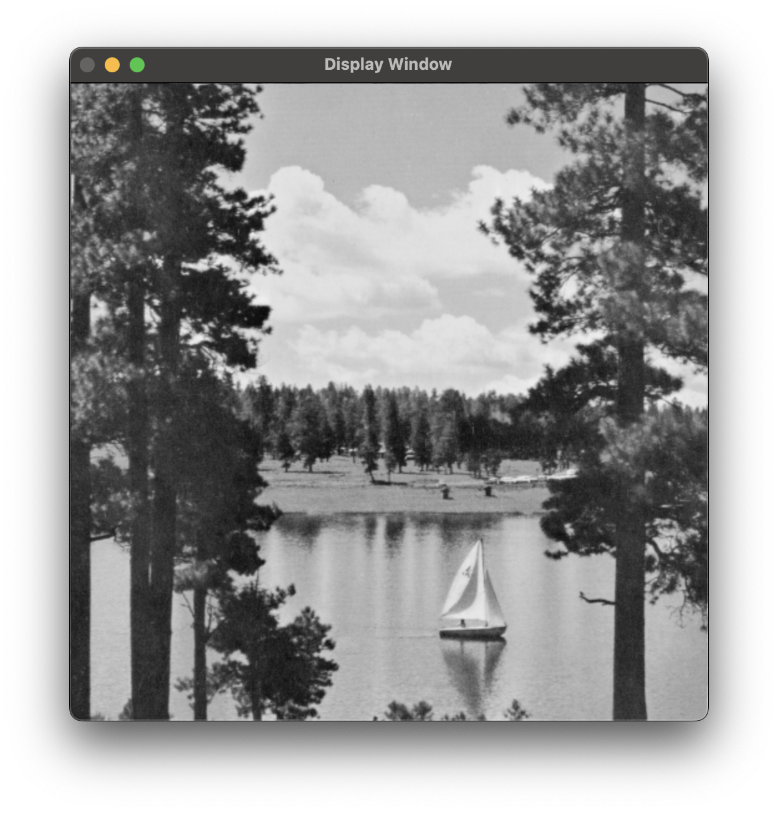 | 
| `./ImageDecoder -load "../../../datasets/image/boat.ppm" -display`| `./ImageDecoder -load "../../../datasets/image/boat.ppm" -grayscale -display `| 

### Pixel values before `(RGB)` and after `(GRAYSCALE)` convertion
```md
    - Pixel (0,0): R: 101 , G: 0   , B: 0    | Gray: 30  
    - Pixel (0,1): R: 10  , G: 0   , B: 88   | Gray: 13  
    - Pixel (0,2): R: 19  , G: 0   , B: 78   | Gray: 14  
    - Pixel (0,3): R: 18  , G: 0   , B: 109  | Gray: 17  
    - Pixel (1,0): R: 123 , G: 0   , B: 0    | Gray: 36  
    - Pixel (1,1): R: 135 , G: 129 , B: 82   | Gray: 125 
    - Pixel (1,2): R: 131 , G: 126 , B: 86   | Gray: 122 
    - Pixel (1,3): R: 122 , G: 115 , B: 81   | Gray: 113 
    - Pixel (2,0): R: 126 , G: 0   , B: 0    | Gray: 37  
    - Pixel (2,1): R: 129 , G: 139 , B: 76   | Gray: 128 
    - Pixel (2,2): R: 139 , G: 136 , B: 78   | Gray: 130 
    - Pixel (2,3): R: 128 , G: 120 , B: 82   | Gray: 118 
    - Pixel (3,0): R: 123 , G: 0   , B: 0    | Gray: 36  
    - Pixel (3,1): R: 136 , G: 120 , B: 97   | Gray: 122 
    - Pixel (3,2): R: 134 , G: 140 , B: 93   | Gray: 132 
    - Pixel (3,3): R: 127 , G: 130 , B: 97   | Gray: 125 
```
Result of the following command:
> ./ImageDecoder -load "../../../datasets/image/boat.ppm" -channels 

---
<br>


###  **Gaussian blur filter** 
---
Tipically used to reduce image **noise** and reduce **detail**.
    
A Gaussian blur filter uses a convoltion matrix (kernel) to smooth the image by averaging pixel values with their neighbors (using a Gaussian function), for each of the 3 channels(RGB):
- **Gaussian kernel**: created based on a kernel size and **$ \sigma $** ;
- **Convoltion Operation**: of the image with the gaussian kernel for each channel

***Convoltion***: is a mathematical operation of two functions, resulting in a third function:

$$
(f * g)(t) = \int_{-\infty}^{\infty} f(\tau)g(t - \tau) \, d\tau \equiv (f * g)(n) = \sum_{m=-\infty}^{\infty} f(m)g(n - m)
$$


**How does kernel size and sigma affect the bluer effect?**
1. **Sigma (σ) - Controls How Much Detail is Lost**: Sigma defines how much influence the neighboring pixels have when averaging a pixel's value.
    - <u>Smaller sigma values</u>: will result in a subtle blur where only nearby pixels contribute significantly to the final value, **preserving more details**.
    - <u>Larger sigma values</u>: will cause more pixels to contribute to the blur, making the result smoother and **less detailed**.
```md    
    The larger the sigma, the more blurred the image becomes(more details are lost).
```
2. **Kernel Size - Defines the Area Over Which the Blur is Applied**: Kernel size determines how large an area ($x \times x $) around each pixel is considered when applying the blur. 
    ```md
    # KERNEL SIZES must be ODD NUMBERS, because they represent a matrix around one specific pixel, so if we choose an EVEN NUMBER I do not have a central pixel.
    ```
    - <u>A small kernel size</u>: only considers the nearest neighbors, so the **blur is localized** and affects only a small area.
    - <u>A larger kernel size</u>: means the algorithm will look at a wider area of the image, blurring a larger region around each pixel.
```md
    The larger the kernel size, the wider the area of the image that gets blurred, 
    causing the blur effect to spread over a larger region.
```
### Visual demonstration
| **Color image** (boat.ppm) | **Blur <7> <2> image** (boat.ppm) |
|----------------------------|--------------------------------|
|   |  | 
| `./ImageDecoder -load "../../../datasets/image/boat.ppm" -display`| `./ImageDecoder -load "../../../datasets/image/boat.ppm" -gaussian 7 2 -display `| 

**CONCLUSION**
- **SIGMA**: Dictates how much smoothing is done (higher sigma means more smoothing and more detail loss).
- **KERNEL**: Defines the region of influence (larger kernel means the blur affects a wider area around each pixel).

---
<br>

### **MATRIX OF ABSOLUTE DIFFERENCE**
---
The matrix of absolute differences between two images is a pixel-by-pixel comparison that helps quantify how much two images differ from each other.
        
$$
D(i,j) = |A(i,j) - B(i,j)|
$$

    - (i,j) , position of the pixel
    - A(i,j) and B(i,j) , intensity values (or color channels)


Tipically used to see how much a image changed :
- after a compression, 
- temporal images, 
- user resgistration < aligning images like when using the fnac.pt website>

### Visual interpretation :
- <u>Brighter areas</u> : suggests **significant differences**
- <u>Darker areas</u> : suggests **similarities**

|**Original image** (boat.ppm) | **2lvl. Quantized image** (boat.ppm) | **Abs. Difference** (boat.ppm) |
|-|-|----------------------------|
|  |  |  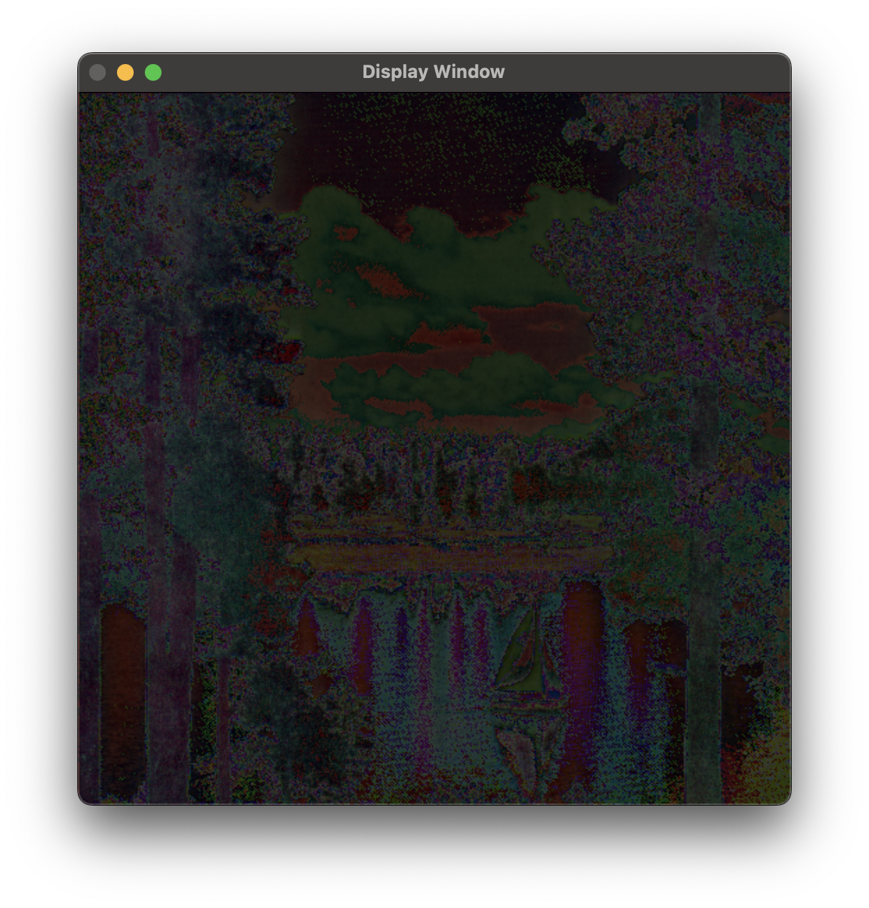 |
| `./ImageDecoder -load "../../../datasets/image/boat.ppm" -display` | `./ImageDecoder -load "../../../datasets/image/boat.ppm" -quantization 2 -display` | ` ./ImageDecoder -diff -load "../../../datasets/image/boat.ppm" -quantization 2 , -load "../../../datasets/image/boat.ppm" -display;  `|

- With this we can estimate the quantity of information lost during the process of quantization.

---
<br>

###  **MSE and PNSR** 
---
```md    
    - MSE   : Mean Squared Error
    - PSMR  : Peak Signal-to-Noise Ratio
```

1. **MSE quantify the difference between two images** - mesuring the *average* squared difference between corresponding pixels in two images:
    - <u>Lower MSE</u> =  **higher** similarity (less diffences)
    - <u>Higher MSE</u> = **lower** similarity (more differences)

$$
\text{MSE} = \frac{\sum \text{s}}{\text{p} \times \text{c}}
$$
        
            - s , square difference
            - p , total nº of pixels
            - c , number of channels  
         
2. **PSNR (dB) quantify the quality of a reconstructed/compressed image** - measuring the ratio between the maximum possible value and the noise ( difference between two images):
    - <u>Lower PSNR</u> = images have significant differences(more noise/distortions)
    - <u>Higher PSNR</u> = images are more similar(less noise/distortions)

$$
\text{PSNR} = 10 \times \log_{10} \left( \frac{255^2}{\text{MSE}} \right)
$$

<br>

**CONCLUSION**
- **MSE** and **PSNR** complement each other. 
- They are used together in image processing to quantify differences and the level of distortion in images

---
<br>

###  **QUANTIZATION** 
---
```md    
    - Reduction of bits used to represent an image, by reducing the number of distinct colors or intensity levels used to represent an image
```
This process reduces the number of bits to represent each pixel, compressing the image. However, quantization inherently introduces some loss of information, which can affect image quality.

$$
Q(x) = \text{round}\left( \frac{x}{\text{stepSize}} \right) \times \text{stepSize} \quad,\quad \text{stepSize} = \left( \frac{256}{2^{q}} \right)
$$

    - x , pixel value
    - q , quantization level(nº bits) 

In this formula we use the `stepSize` to distribute the quantized color on the hole gamma of colors.

- ***Grayscale Image***:
    - **Pixel representation**: 
        - Single intensity value [*0 to 256*] `8 bits`.
    - **Quantization process**: 
        - Reducing the number of intensity levels, mapped to original `8bits gamma` 
- ***RGB Image***:
    - **Pixel representation**: 
        - Three intensity values: **R** `8 bits`, **G** `8 bits`, **B** `8 bits`.
    - **Quantization process**: 
        - Reducing the intensity levels for each channel (R, G, B), mapped to original `8bits gamma`    
<br>

#### - <u>QUANTIZATION LEVELS</u>:
- Refers to the number of $bits$ to represent different intensity values ($2^{bits}$) that a pixel can take after quantization.

    - **1-bit quantization** => 2 intensity levels $(2^1 = 2)$.
    - **2-bit quantization** => 4 intensity levels $(2^2 = 4)$.
    - **8-bit quantization** => `ORIGINAL IMAGE` 256 intensity levels $(2^8 = 256)$.

    >- *Grayscale* : The number of different **gray shades**
    >- *RGB* : The number of **colors**

| Quantization level : 7 (boat.ppm & boat.ppm - grayscale) | Quantization level : 3 (boat.ppm & boat.ppm - grayscale)|
|----------------|----------------|
| 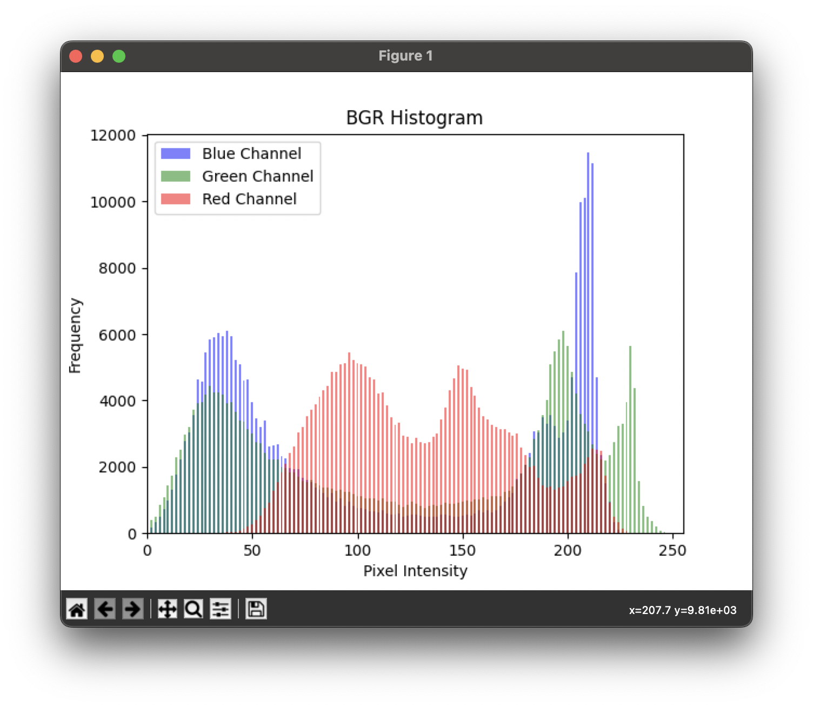 | 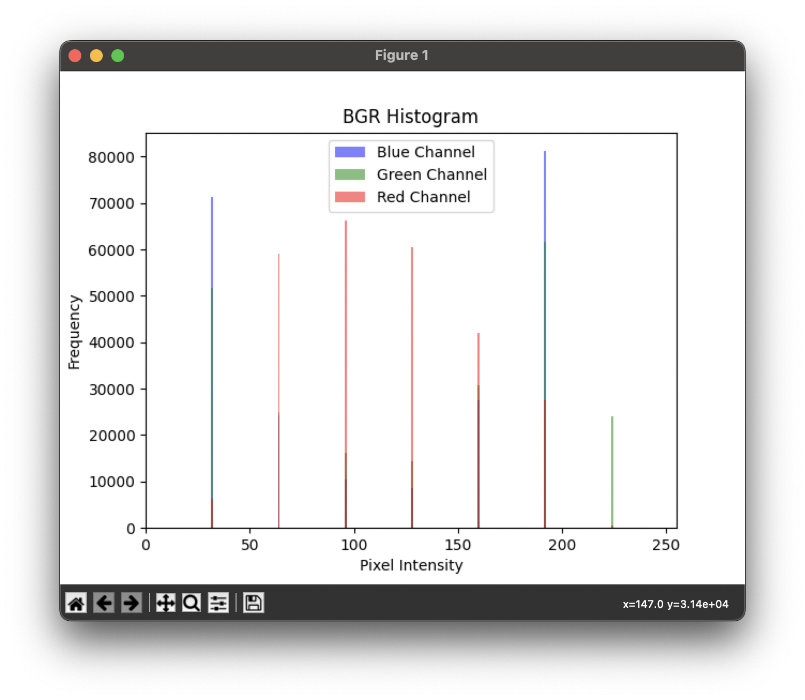 |
| `./ImageDecoder -hist -load "../../../datasets/image/boat.ppm" -quantization 7 ` | `./ImageDecoder -hist -load "../../../datasets/image/boat.ppm" -quantization 3 ` |
| 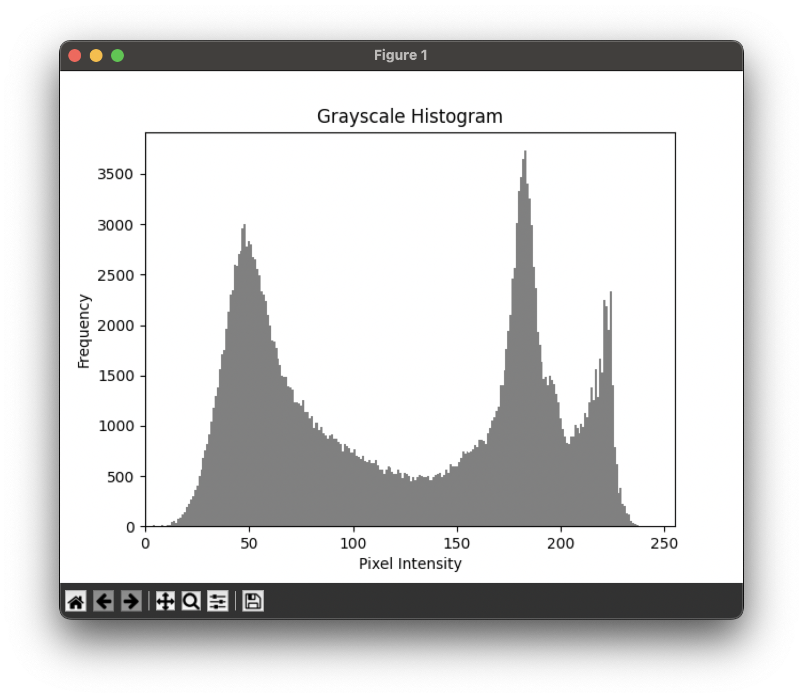 | 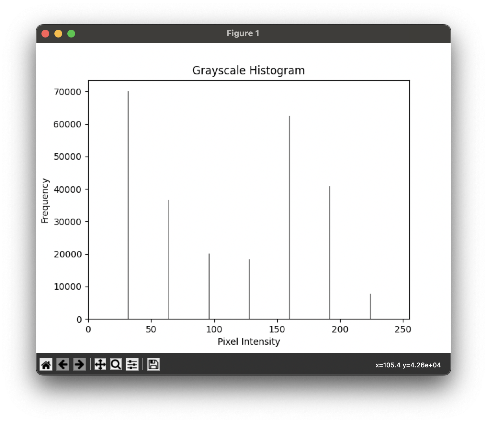 |
| `./ImageDecoder -hist -load "../../../datasets/image/boat.ppm" -grayscale -quantization 7 ` | `./ImageDecoder -hist -load "../../../datasets/image/boat.ppm" -grayscale -quantization 3 ` |
</p>

---

<br>

- **Effects of Quantization Levels on Image**:
    - **Detail loss:**
        - <u>**higher levels**</u>: Preserve more detail
        - <u>**lower levels**</u>: Significant detail loss *(2 bits mean only 4 levels, resulting in more uniform areas)*

        | Quantization level : 7 (boat.ppm) | Quantization level : 2 (boat.ppm) |
        |------------------------|------------------------|
        | 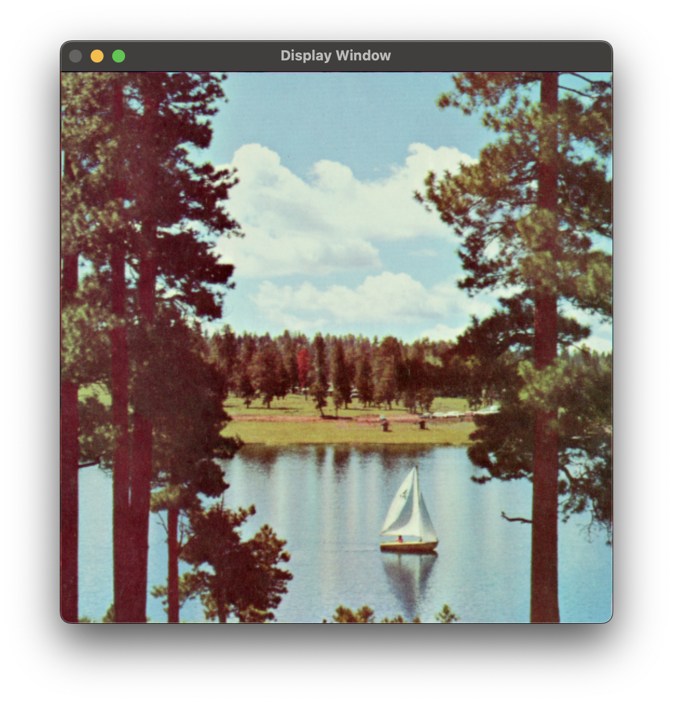 | 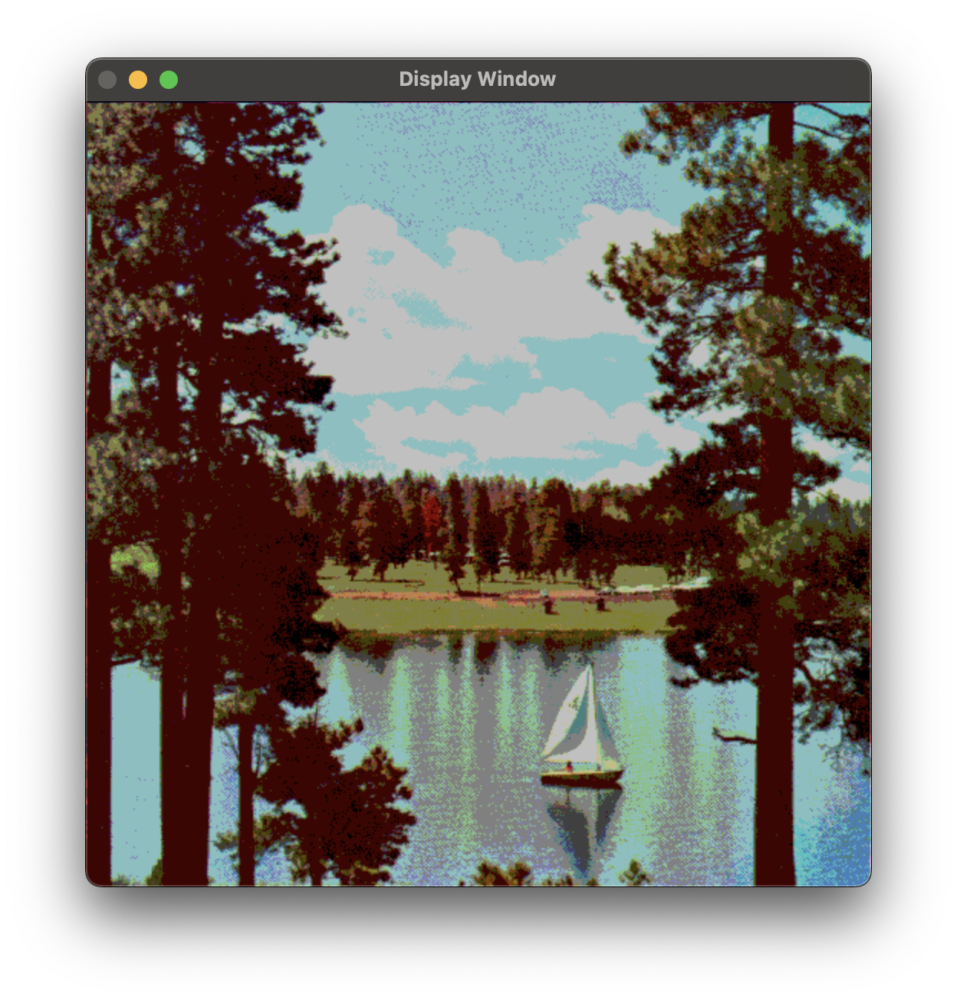 |
        | `./ImageDecoder -load "../../../datasets/image/boat.ppm" -quantization 7 -display` | `./ImageDecoder -load "../../../datasets/image/boat.ppm" -quantization 2 -display`|

    - **Compression:**
        - <u>**higher levels**</u>: Weak compression
        - <u>**lower levels**</u>: Strong compression (fewer bits are used to represent each pixel)

    `As you can see above, compression and detail loss are inversely related`
<br>

### Comparing the original image with the quantized one using MSE and PSNR to evaluate the quality.
Comparing the original image with the quantized one using ***MSE*** and ***PSNR*** show us how much image quantization affects the visual quality of the image. 

| stats | Quantization Lvl = 2bits | Quantization Lvl = 5bits | Quantization Lvl = 7bits | 
|-------|---------|---------|---------|
| **MSE** | 1172.41 | 17.3985 | 0.495516 |
| **PSNR** | 17.44 dB | 35.7257 dB | 51.1802 dB |

- At a `quantization level of 2`, the <u>MSE is significantly high</u> (19680.2), indicating a substantial difference from the original image, with many pixels changing drastically. Correspondingly, the <u>PSNR is low</u> (5.19 dB), reflecting a notable loss of detail and image degradation. 
- As the `quantization levels increase (150 and 230)` the <u>MSE decreases</u>, indicating fewer differences between the quantized and original images. The <u>PSNR values rise</u>, showing a clearer and more accurate image with less noticeable degradation.

> This coherence between quantization levels and error metrics demonstrates that as the number of quantization levels increases, more details are preserved, and the image quality improves.

---
<br>

### **HighPass Filter**
---
With the function that already have I tried to make another "filter" and I found the $HighPass filter$, that is somehow a simplistic <u>edge detector</u>.

In theory:

$$
    \text{HighPass Filter} = Image - \text{LowPassFilter}
$$

```
    LowPass Filter --> Gaussian blur filter to remove the high frequencies detail `edges` 
```

- This difference will highlight what we try to remove with the lowPass Filter, so the `edges will appear`.

| **Original Image** (arial.ppm) | **Image with HighPass filter** (arial.ppm) |
|--------------------------------|--------------------------------------------|
| 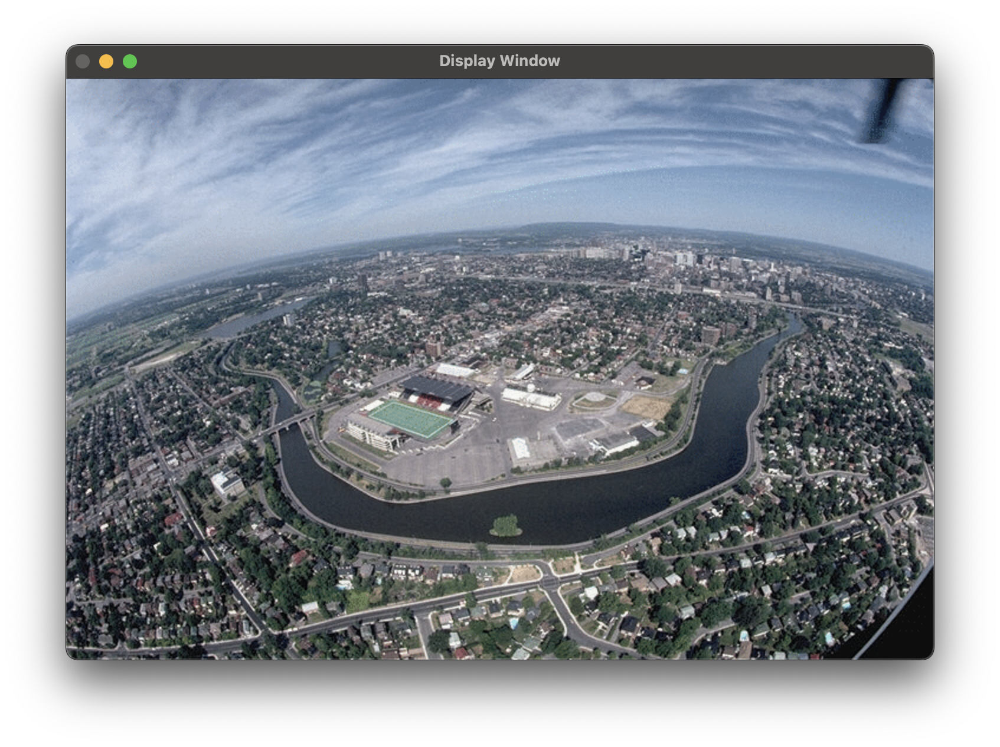 | 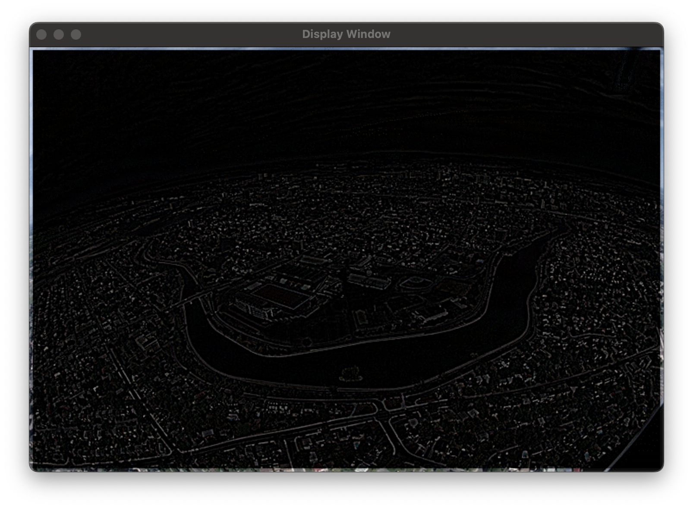 |
| `./ImageDecoder -load "../../../datasets/image/arial.ppm" -display` | `./ImageDecoder -load "../../../datasets/image/arial.ppm" -highPass -display` |


But now we depared ourselves with a problem... the image after this transformation got a **`FRAME`**. Why does this appear? 

1. Interpreting the result:
    - **darker zones** => $HighPass filter$ result is **low** => **small differences** between original and blured image ==> **`MINIMAL CHANGE`**
    - **brighter zones** => $HighPass filter$ result is **high** => **larger differences** between original and blured image ==> **`LARGER CHANGE`**

<br>

So we have big differences in the frame of the image and the problem can only reside on the $LowPass filter$, aka <u>gaussian blur filter</u>:

### The effect is not being applied to border in the same way as the rest of the pixels from the image.

```
    - KERNEKL 3x3 for all

     PIXEL (5x5)           PIXEL (1x5)       PIXEL (0x0)
    .___.___.___.          .___.___.         .___.___.
    |___|___|___|          |___|___|         |_x_|___|
    |___|_x_|___|          |_X_|___|         |___|___|
    |___|___|___|          |___|___|

```
With this representation we can see the problem. The **3x3 kernel** is applied to every pixel, but at the image borders, the kernel doesn’t have sufficient surrounding pixel values for `convoltion`, causing distortions like the "frame" effect

- **Solutions**:
    - ***Replicate border***
        - border pixels are copied from the nearest edge of the image
        ```
            - KERNEKL 3x3 for all

            PIXEL (5x5)             PIXEL (1x5)           PIXEL (0x0)
            .___.___.___.          .___.___.___.         .___.___.___.
            |_1_|_2_|_3_|          |_/_|_1_|_2_|         |_/_|_/_|_/_|
            |_4_|_X_|_6_|          |_/_|_X_|_4_|         |_/_|_X_|_2_|
            |_7_|_8_|_9_|          |_/_|_5_|_6_|         |_/_|_3_|_4_|

            - AFTER REPLICATE

            PIXEL (5x5)             PIXEL (1x5)           PIXEL (0x0)
            .___.___.___.          .___.___.___.         .___.___.___.
            |_1_|_2_|_3_|          |_1_|_1_|_2_|         |_X_|_X_|_2_|
            |_4_|_X_|_6_|          |_X_|_X_|_4_|         |_X_|_X_|_2_|
            |_7_|_8_|_9_|          |_5_|_5_|_6_|         |_3_|_3_|_4_|

        ```

    - ***Reflect border***
        - the pixels outside the border are reflected acress the edge 
        ```
            - KERNEKL 3x3 for all

            PIXEL (5x5)             PIXEL (1x5)           PIXEL (0x0)
            .___.___.___.          .___.___.___.         .___.___.___.
            |_1_|_2_|_3_|          |_/_|_1_|_2_|         |_/_|_/_|_/_|
            |_4_|_X_|_6_|          |_/_|_X_|_4_|         |_/_|_X_|_2_|
            |_7_|_8_|_9_|          |_/_|_5_|_6_|         |_/_|_3_|_4_|

            - AFTER REFLECT

            PIXEL (5x5)             PIXEL (1x5)           PIXEL (0x0)
            .___.___.___.          .___.___.___.         .___.___.___.
            |_1_|_2_|_3_|          |_2_|_1_|_2_|         |_4_|_3_|_4_|
            |_4_|_X_|_6_|          |_4_|_X_|_4_|         |_2_|_X_|_2_|
            |_7_|_8_|_9_|          |_6_|_5_|_6_|         |_4_|_3_|_4_|

        ```

| **Original Image** (arial.ppm) | **Image with HighPass filter** (arial.ppm) |
|--------------------------------|--------------------------------------------|
|  | 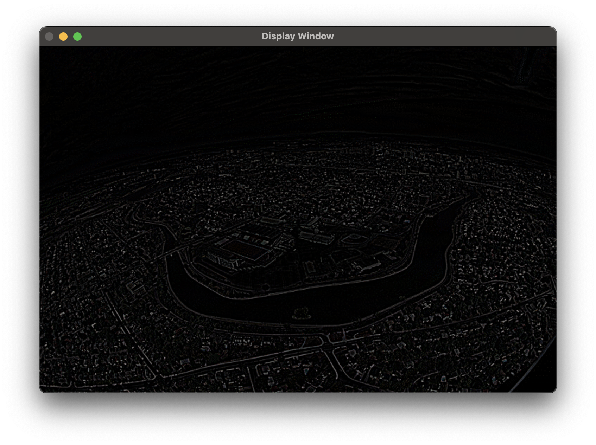 |
| `./ImageDecoder -load "../../../datasets/image/arial.ppm" -display` | `./ImageDecoder -load "../../../datasets/image/arial.ppm" -highPass -display` |
|  | using OpenCv function to calculate the *GaussianFilter* with BORDER_REPLICATE |

---

<br>

### INVERT COLORS
---
Inverting Colors adjusts each pixel to its opposite hue, enhancing the image’s visual contrast and creating a unique visual effect. Darker areas become light, and light areas become dark, which can be particularly useful in creative photography, visual art, and certain technical fields where detecting outlines and patterns in a different light is beneficial.

Invert Colors Function:
- Steps for inverting colors:
    1. For each pixel, subtract the pixel's color value from the maximum intensity (255 for 8-bit images).
    2. Replace the original pixel value with the calculated inverted value.

| **Original Image** (manuscript.jpg) | **Image with Invertion Colors filter** (manuscript.jpg) |
|--------------------------------|--------------------------------------------|
|  |  |
| `./ImageDecoder -load "../../../datasets/image/manuscript.jpg" -display ` | `./ImageDecoder -load "../../../datasets/image/manuscript.jpg" -invert -display ` |
| **Original Image** (letter.jpg) | **Image with CONSTRAST ENHANCEMENT filter** (letter.jpg) |
|  | 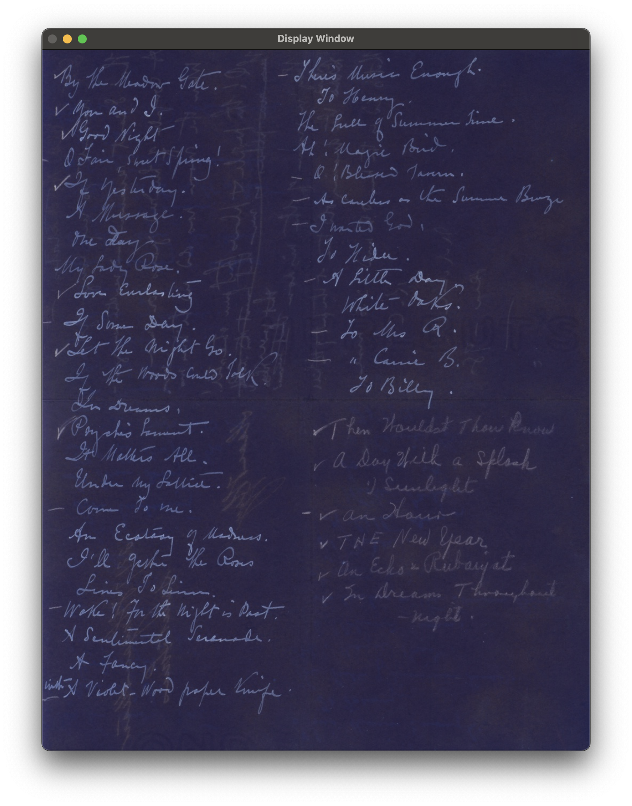 |
| `./ImageDecoder -load "../../../datasets/image/letter.jpg" -display ` | `./ImageDecoder -load "../../../datasets/image/letter.jpg" -invert -display ` |

- Inverted colors can make faint or faded text more readable by increasing the contrast in ways that are difficult to achieve with standard color or grayscale images.

---
<br>

### CONSTRAST ENHANCEMENT
---
Contrast Enhancement (Histogram Equalization) , redistributes brightness to balance contrast, which helps darker images appear brighter by enhancing details in low-contrast areas.

- Steps for Histogram Equalization:
    1. Calculate the histogram of the image.
    2. Normalize the histogram to create the cumulative distribution function (CDF).
    3. Use the CDF to map the intensity values in the image to new values.
    4. Apply the transformation to the original image.

>  Often used in medical imaging and satellite imagery to enhance details, and also in photography to improve contrast.

| **Original Image** (satelite.jpeg) | **Image with CONTRAST ENHANCEMENT filter** (satelite.jpeg) |
|--------------------------------|--------------------------------------------|
|  |  |
| `./ImageDecoder -load "../../../datasets/image/satelite.jpeg" -display ` | `./ImageDecoder -load "../../../datasets/image/satelite.jpeg" -contrast -display ` |
| **Original Image** (castle.jpg) | **Image with CONTRAST ENHANCEMENT filter** (castle.jpg) |
|  |  |
| `./ImageDecoder -load "../../../datasets/image/castle.jpg" -display ` | `./ImageDecoder -load "../../../datasets/image/castle.jpg" -contrast -display ` |

Using this filter:
1. We can easly identify the different depths on the coastal sea bed
2. We can get more detail on a night picture 