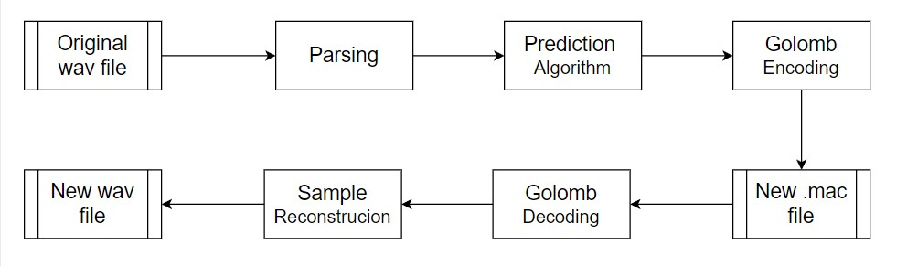

<!-- 
This is the README file for Part III of Project 2 in the IC course. 
-->
# PROJECT 2 : Part III
Author: João Oliveira

- **Build and Run**
    ```bash
    mkdir build
    cd build
    cmake ..
    make
    ```
    Then you can execute ./AudioCodec by choosing either lossless or lossy(coming soon) compression and providing the paths for the desired files. Example:

    ```bash
    ./AudioCodec lossless ../../../datasets/audio/sample01.wav ../audio.mac ../newAudio.wav
    ```

    This will alow you to compress sample01.wav into the audio.mac file and then decode it into newAudio.wav (you can adjust file names to your liking).

## **Audio handling**

In this part of our project we aimed to create an Audio Codec for compression of audio files. This was done using prediction mechanisms, golomb encoding and bitStream for reading and writing operations.

## **Header**
First, we had to extract the required data from the desired audio file (as shown in audioParser.cpp). To do this, we first needed to be aware of the structure of a wave file.

<p align="center">
        
    <p align="center">
    The header of a wave file

It is worth noting that the fields in a wave file header are written in little endian format (the only ones that aren't are the IDs and descriptors, as those are strings), so we had to adapt our bitStream to read and later write in little endian format.

With these fields in mind, we extracted the necessary information and created the header of our own file.
We defined with our file with the following header:


| Field             | Size |
|-------------------|------|
| Identifier        | 10   |
| Sample rate       | 32   |
| Channel Count     | 16   |
| Sample size       | 16   |
| Number of samples | 32   |
| Golomb parameter  | 16   |
| Residuals         | ...  |


## **Handling the samples**
After writing the header with the necessary metadata, we proceeded to deal with the audio samples.

We used a first order predictor to calculate the difference between a sample and its predecessor and used that difference to proccess our audio.

Before we wrote the residuals to the file, we used Golomb coding to encode the residuals and thus reduce their size.
The key to Golomb coding is choosing the right Golomb Parameter (m). Initially (for testing purposes), we used a fixed value for m, this was very inneficient however and the resulting file ended up even bigger than the original!

So we created a function to calculate the optimal Golomb parameter, using the following formula:
$$
    Mean = \frac{\sum_ {}residuals}{TotalResiduals}
$$
And:
$$
    m = \frac{mean + 1}{2}
$$

Where residuals were the result of applying prediction to the original samples.

## **Encoding Results**

After applying first order prediction and calculating a custom Golomb parameter the compression improved. We ran: 

```bash
./AudioCodec lossless ../../../datasets/audio/sample01.wav ../audio.mac ../newAudio.wav
```

And from the 5.2mb file we obtained a compressed 4.4mb file. 

## **Decoding**

To reconstruct the original audio file, we started by using our bitStream to read the header of our compressed file and obtaining the necessary metadata and wrote it to the new wave file. 

Afterwards, we read the data portion of the file and obtained a vector with the residuals. We used the golomb parameter read in the header and used it to decode the residuals. 

With the decode residuals, we preformed the inverse operation to the prediction algorithm and reconstructed the original samples from the residuals.

Now that we had all the necessary data we wrote everything to the wave file, being careful with how we wrote the header structure and how we calculated the necessary fields (such as the file size). The end result was a wave file identical to the original, runnign: 

```bash
./AudioCodec lossless ../../../datasets/audio/sample01.wav ../audio.mac ../newAudio.wav
```

We obtained a 5.2mb newAudio.wav file that matches up with the 5.2mb sample01.wav file.

Our resulting pipeline endend up looking something like this:

<p align="center">
        
    <p align="center">
    Project pipeline