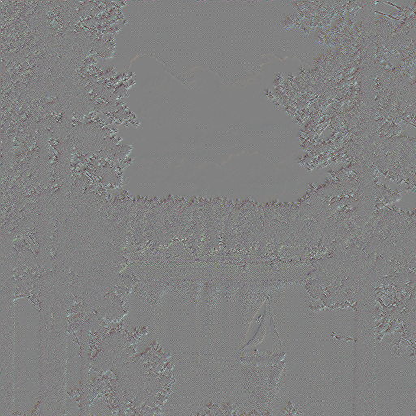

<!-- 
This is the README file for Part IV of Project 2 in the IC course. 
-->
# IC - Information and Coding (2024/25)

Return to the main README : [Project 2 - README](../../project2/README.md)

<br>
<br>

---
# Part IV – Image and Video Coding with Predictive Coding

<br>
<br>

## T1 - Lossless image coding using predictive coding

### OPTION SELECTION:

```java
COMMAND :   "-ImgCoding" arg  
        ;

arg     :    "-load" IMAGE ("-SignMag"|"-PosNeg") ("-m" NUM)* 
        ;

IMAGE   :  path_to_image
        ; 

NUM     :    [0 9]+;
```
1. **COMMAND:**
A command can be:
    - `-ImgCoding` ***arg*** --> Command to load the Image Coding algorithm

2. **arg:**
    - `-load` ***IMAGE*** `-SignMag | -PosNeg`--> load the *IMAGE* and choose the type of encoding for **Golomb coding**:
        - `-SignMag` ***(Sign and magnitude)***: encode the sign separately from the magnitude
        - `-PosNeg` ***(Positive/negative interleaving)***: Use a zigzag or odd-even mapping to interleave positive and negative
values, so all numbers map to non-negative integers.
    - <u>***Optionally***</u>:
        - `-m` ***NUM*** --> The **Golomb coding scheme** requires a parameter `m`, which controls the encoding length.
            - If ***provided***, the encoding uses this fixed `m` value.
            - If ***not provided***, the algorithm calculates an optimal `m` (**as explained before**) by:
                1. Calculating the mean absolute residual value.
                2. Setting \( m = 1 \) initially.
                3. Doubling \( m \) until \( m \geq \text{mean absolute residual} \).

3. **IMAGE:**
    - ***Path*** where the image is stored.

4. **NUM:**
    - ***Integer*** value.

### COMMAND EXAMPLES:

1. **Encode `image1` using a Sign and magnitude approach with optimal value for m**
```bash
./ImageCoding -ImgCoding -load "boat.ppm" -SignMag
```
2. **Encode `image1` using a Sign and magnitude approach with `m` = 6**
```bash
./ImageCoding -ImgCoding -load "boat.ppm" -SignMag -m 6
```
3. **Encode `image1` using a Positive/negative interleaving approach with optimal value for m**
```bash
./ImageCoding -ImgCoding -load "boat.ppm" -PosNeg
```
4. **Encode `image1` using a Positive/negative interleaving approach with `m` = 12**
```bash
./ImageCoding -ImgCoding -load "boat.ppm" -PosNeg -m 12
```

---
<br>

## Header Design
The header has the following format:
- **Image Type (1 byte)**: 0 for grayscale, 1 for color.
- **Golomb Coding Type (1 byte)**: 0 for SIGN_MAG, 1 for POS_NEG.
- **Optimal m (4 bytes)**: Stored as an integer.
- **Image Width (4 bytes)**: Stored as an integer.
- **Image Height (4 bytes)**: Stored as an integer.
- **Format String (Variable Length)**: The format string (e.g., "PPM"), terminated by the delimiter.
- **Delimiter (#)**: A single byte ('#') to mark the end of the header.


This results in a `15-byte header(fixed)` + `X(format string)` + `1-byte (delimiter)` before the encoded data.
- for a `.png` total size of header = 15 + 3 + 1 = 19 bytes;


### A. ENCODING
1. Load the image
    - extract necessary info to write the header
2. Use a Median Edge Predicition
    - it works like the simple neighboring exploration to predict the pixel value
3. Use a matrix of Residuals
    - keep the difference between the original and the predited pixel
4. Use golomb encoding:
    - on the residuals matrix apply the golomb coding
5. Additionally we created 2 tests in order to see if we could achieve better compression ratios:

    - `Huffman` and `Arithmetic` coding work best when the input data exhibits high statistical redundancy and predictable patterns. The images' data lacks these properties, the compression ratio was not improved:

    - `Huffman Encoding` : 
        - **Limited Adaptability** : Huffman coding does not adapt to varying probabilities across different parts of the image. If local regions of the image have distinct statistical properties, the compression was not optimal.
        - **Small Symbol Set** : If the residuals or pixel values have a uniform distribution or a small range of values, Huffman coding will not achieve significant compression.

    - `Arithmetic Encoding` :
        - **Ineffective Probability Models** : If the probability model used for arithmetic coding does not accurately reflect the actual distribution of the data, the coding efficiency will be reduced, and we can not achieve a pprobability model suited for all differente images.
        - **High Overhead** : Arithmetic coding involves computational overhead and precision challenge. With its use, the encoding time can be more than 5 times longer than standard compression methods, and the resulting compression ratio may also be less efficient.

### B. DECODING
1. Apply the Golomb decoding
    - After this we obtained the residuals matrix
2. Use Media Edge Prediction to reconstruct the image
    - Do the same as in encoding
    - Use the residuals matrix and predict the pixel
    - Getting the original

--- 
### COMPRESSION RATIOS:

| Encoding Approuch |  m  | coded file size(KB) | original size(KB) | encoding ratio(%) |
|-------------------|-----|-----------------|---------------|----------------|
| ***Positive Negative*** | ***optimal*** |  ***563***  | ***786*** | **28** |
| Signal and Magnitude | optimal | 612 | 786 | 22 |
| Positive Negative | 6 | 650 | 786 | 17 |
| ***Signal and Magnitude*** | ***6*** | ***605*** | ***786*** | **23** |
| Positive Negative | 12 | 599 | 786 | 24 |
| Signal and Magnitude | 12 | 629 | 786 | 20 |

### ***Considerations***:
- The best compression ratio was achieved using the Positive/Negative approach in Golomb coding, with the calculated optimal `m` value.
- Interestingly, the optimal `m` value appears to be effective only for the Positive/Negative approach. For the Signal and Magnitude approach, the best compression ratio was obtained when `m = 6`, contrary to the expected outcome using the calculated optimal value.

<br>
<br>

---
## CONCLUSIONS:
- 1st attempt : We tried to convert the image to grayscale to achieve greater compression. While this worked to some extent, it failed to retain the original colors, confirming that the compression was not lossless, as expected.
- 2nd attempt: we tried to transform the residual values into positive values to facilitate encoding with Golomb coding. However, this did not yield a better compression ratio and instead increased complexity.

- `FINAL CONCLUSION` In this task, we were unable to achieve a significantly higher compression ratio (***best result: 28%***), despite various attempts, including using `Huffman` and `Arithmetic` coding, treating the image as grayscale, and other strategies. However, we successfully adhered to the primary objective of achieving ***LOSSLESS*** compression.


#### CURIOSITIES:
The following image is the representation of the residuals for :
```shell
./ImageCoding -ImgCoding -load "boat.ppm" -PosNeg
```
 

<br>
<br>
<br>

---

## T2 - Intra-Frame Video Coding

### STEPS TO IMPLEMENT INTRA-FRAME VIDEO
1. Modify the imput handling for video files
    - use OpenCv's :
        - `cv::VideoCapture` to load the video file,
        - `cv::VideoCapture::read()` to extract frames and process them one by one
        - `cv::VideoWritter` to combine frames into a video

2. Encode Each frame independently
    - treat each frame as an image and apply existing image codec
    
3. The header must now have differences and must have for example the number of frames
    - here we can have various approuch like have info for each frame, like the `m` etc... or have a unique header!


### OPTION SELECTION:

```java
COMMAND :   "-Video" arg  
        ;

arg     :   VIDEO ("-SignMag"|"-PosNeg") ("-m" NUM)* 
        ;

VIDEO   :  path_to_video
        ; 

NUM     :    [0 9]+;
```
1. **COMMAND:**
A command can be:
    - `-Video` ***arg*** --> Command to load the Video Coding algorithm

2. **arg:**
    - ***VIDEO*** `-SignMag | -PosNeg`--> load the *VIDEO* and choose the type of encoding for **Golomb coding**:
        - `-SignMag` ***(Sign and magnitude)***: encode the sign separately from the magnitude
        - `-PosNeg` ***(Positive/negative interleaving)***: Use a zigzag or odd-even mapping to interleave positive and negative
values, so all numbers map to non-negative integers.
    - <u>***Optionally***</u>:
        - `-m` ***NUM*** --> The **Golomb coding scheme** requires a parameter `m`, which controls the encoding length.
            - If ***provided***, the encoding uses this fixed `m` value.
            - If ***not provided***, the algorithm calculates an optimal `m` (**as explained before**) by:
                1. Calculating the mean absolute residual value.
                2. Setting \( m = 1 \) initially.
                3. Doubling \( m \) until \( m \geq \text{mean absolute residual} \).

3. **VIDEO:**
    - ***Path*** where the video is stored.

4. **NUM:**
    - ***Integer*** value.

### COMMAND EXAMPLES:

1. **Encode `video1` using a Sign and magnitude approach with optimal value for m**
```bash
./IntraCoding -Video "movie1.mp4" -SignMag
```
2. **Encode `video1` using a Sign and magnitude approach with `m` = 6**
```bash
./IntraCoding -Video "movie1.mp4" -SignMag -m 6
```
3. **Encode `video1` using a Positive/negative interleaving approach with optimal value for m**
```bash
./IntraCoding -Video "movie1.mp4" -PosNeg
```
4. **Encode `video1` using a Positive/negative interleaving approach with `m` = 12**
```bash
./IntraCoding -Video "movie1.mp4" -PosNeg -m 12
```

---
<br>

## Header Design
The header has the following format:
- **Frame count (16 bytes)**: prepared for 9999 frames.
- **Golomb Coding Type (1 byte)**: 0 for SIGN_MAG, 1 for POS_NEG.
- **Optimal m (4 bytes)**: Stored as an integer.
- **Image Width (4 bytes)**: Stored as an integer.
- **Image Height (4 bytes)**: Stored as an integer.
- **Format String (Variable Length)**: The format string (e.g., "PPM"), terminated by the delimiter.
- **Delimiter (#)**: A single byte ('#') to mark the end of the header.


This results in a `29-byte header(fixed)` + `X(format string)` + `1-byte (delimiter)` before the encoded data.
- for a `.mp4` total size of header = 29 + 3 + 1 = 33 bytes;

<br>

### A. ENCODING
1. **Load the Video**:
    - The codec opens the video file and extracts key information to write the header:
        - Number of frames, video width, height, and format.
        - Golomb coding parameters (type and value of m).
    - Each frame is processed independently (intra-frame coding) without leveraging inter-frame compression.
2. **Apply Median Edge Prediction**
    - The median edge prediction algorithm predicts pixel values based on spatial neighbors
    - The algorithm evaluates these neighbors to predict the most likely pixel value for each position in the frame.
3. **Generate Residual Matrix**
    - A residual matrix is created for each frame:
        - Each pixel's residual is the difference between the actual value and the predicted value.
        - This residual matrix captures the deviation from the predicted values, effectively compressing spatial redundancy.
4. **Golomb Encoding**
    - The residual matrix of each frame is encoded using Golomb coding:
        - Encodes residuals as efficiently as possible using the Golomb parameter m to achieve compression.
        - Supports two modes for handling negative residuals:
            - **Sign and Magnitude (SignMag)**: Separates the sign from the magnitude.
            - **Positive/Negative Interleaving (PosNeg)**: Maps negative and positive values to non-negative integers.


### B. DECODING
1. **Golomb Decoding**
    - The encoded video is read, and the Golomb decoding is applied to reconstruct the residual matrices.
    - The header information is utilized to decode the residuals accurately.
2. **Reconstruct Frame using Median Edge Prediction**
    - The same median edge prediction algorithm is used to reconstruct each frame:
        - Adds the predicted pixel values to the decoded residuals to obtain the original pixel values.
    - Frame-by-frame reconstruction ensures the decoded video matches the original video, preserving its quality.
4. **Reconstruct Video**
    - The reconstructed frames are written to a video file using the format specified in the header and using compression `H.264`, because the video used is `.mp4`
    - **CONSIDERATIONS**:
        - in order to achieve the same size of the original `video.mp4` we have to use compression, in this case using the OpenCv H.264 compression. 
        - Even with this we do not achieve the same size (*ours: 286 KB, original: 229 KB*), but we are happy with the end result.
--- 
<br>

### COMPRESSION RATIOS & TIMES:

We use 2 videos:
1. `movie.mp4` with 7,6 MB , `m = 8, Pos_Neg`
    - When using the OpenCv function to get the frames we got the value of the **RAW PIXELS** in RGB:
        - knowing the video as the following specs:
            - 1080*1920
            - 410 frames
            - Color ( 3 channels)
        - we can calculate the original size:
            1. 1080 * 1920 = 2073600 pixels/frame
            2. 2073600 * 3 (channels) = 6220800 bytes/frame
            3. 6220800 * 410 (frames) = 2550528000 bytes
            4. *Original Value uncompressed* = **2.38 GB** 
    - **COMPRESSION**:
        - Compressed file = ***1.32 GB***
            - WE ACHIEVED ***44.54 %*** of compression ratio. 
    - **TIMES** :
        - **ENCODING :** *327.802 seconds* = *5,46 min*
        - **DECODING :** *333.693 seconds* = *5,56 min*

<br>
<br>

2. `movie1.mp4` with 229 KB , `m = 8, Pos_Neg`
    - When using the OpenCv function to get the frames we got the value of the **RAW PIXELS** in RGB:
        - knowing the video as the following specs:
            - 270*480
            - 410 frames
            - Color ( 3 channels)
        - we can calculate the original size:
            1. 270 * 480 = 129600 pixels/frame
            2. 129600 * 3 (channels) = 388800 bytes/frame
            3. 388800 * 410 (frames) = 159408000 bytes
            4. *Original Value uncompressed* = **152.1 MB** 
    - **COMPRESSION RATIO**:
        - Compressed file = ***88 MB***
            - WE ACHIEVED ***42.14 %*** of compression ratio. 
    - **TIMES** :
        - **ENCODING :** *20.862 seconds*
        - **DECODING :** *21.6663 seconds*

### ***Considerations***:
- The compression ratio should be calculated based on the **original uncompressed** size (RAW PIXELS in RGB) and not the MP4 size, as the MP4 format is already compressed.
- Both videos achieved a **significant compression ratio of approximately 40%**, indicating effective compression in both cases.
- The difference in original sizes between the videos demonstrates how video resolution and frame count significantly affect the raw file size.
- The compressed file sizes indicate that while higher resolutions (e.g., 1080x1920) inherently require more storage, compression techniques can still achieve substantial reductions.

<br>
<br>
<br>

---

## T4 - Lossy Video Coding with Quantization of Prediction Residuals

### OPTION SELECTION:

```java
COMMAND :   "-Video" arg  
        ;

arg     :   VIDEO ("-SignMag"|"-PosNeg") ("-m" NUM)* ("-q" NUM)
        ;

VIDEO   :  path_to_video
        ; 

NUM     :    [0 9]+;
```
1. **COMMAND:**
A command can be:
    - `-Video` ***arg*** --> Command to load the Video Coding algorithm

2. **arg:**
    - ***VIDEO*** `-SignMag | -PosNeg`--> load the *VIDEO* and choose the type of encoding for **Golomb coding**:
        - `-SignMag` ***(Sign and magnitude)***: encode the sign separately from the magnitude
        - `-PosNeg` ***(Positive/negative interleaving)***: Use a zigzag or odd-even mapping to interleave positive and negative
values, so all numbers map to non-negative integers.
    - <u>***Optionally***</u>:
        - `-m` ***NUM*** --> The **Golomb coding scheme** requires a parameter `m`, which controls the encoding length.
            - If ***provided***, the encoding uses this fixed `m` value.
            - If ***not provided***, the algorithm calculates an optimal `m` (**as explained before**) by:
                1. Calculating the mean absolute residual value.
                2. Setting \( m = 1 \) initially.
                3. Doubling \( m \) until \( m \geq \text{mean absolute residual} \).
        - `-q` ***NUM*** --> quantization level, which controls the trade-off between compression and quality.

3. **VIDEO:**
    - ***Path*** where the video is stored.

4. **NUM:**
    - ***Integer*** value.

### COMMAND EXAMPLES:

1. **Encode `video1` using a Sign and magnitude approach with optimal value for m**
```bash
./IntraLossyCoding -Video "movie1.mp4" -SignMag -q 4
```
2. **Encode `video1` using a Sign and magnitude approach with `m` = 6**
```bash
./IntraLossyCoding -Video "movie1.mp4" -SignMag -m 6 -q 4
```
3. **Encode `video1` using a Positive/negative interleaving approach with optimal value for m**
```bash
./IntraLossyCoding -Video "movie1.mp4" -PosNeg -q 4
```
4. **Encode `video1` using a Positive/negative interleaving approach with `m` = 12**
```bash
./IntraLossyCoding -Video "movie1.mp4" -PosNeg -m 12 -q 4
```


---
<br>

## Header Design (The same as *T2*)
The header has the following format:
- **Frame count (16 bytes)**: prepared for 9999 frames.
- **Golomb Coding Type (1 byte)**: 0 for SIGN_MAG, 1 for POS_NEG.
- **Optimal m (4 bytes)**: Stored as an integer.
- **Image Width (4 bytes)**: Stored as an integer.
- **Image Height (4 bytes)**: Stored as an integer.
- **Format String (Variable Length)**: The format string (e.g., "PPM"), terminated by the delimiter.
- **Delimiter (#)**: A single byte ('#') to mark the end of the header.


This results in a `29-byte header(fixed)` + `X(format string)` + `1-byte (delimiter)` before the encoded data.
- for a `.mp4` total size of header = 29 + 3 + 1 = 33 bytes;

<br>

### A. ENCODING
1. **Load the Video**:
    - The codec opens the video file and extracts key information to write the header:
        - Number of frames, video width, height, and format.
        - Golomb coding parameters (type and value of m).
        - Quantization bit for lossy compression
    - Each frame is processed independently (intra-frame coding) without leveraging inter-frame compression.
2. **Apply Median Edge Prediction**
    - The median edge prediction algorithm predicts pixel values based on spatial neighbors
    - The algorithm evaluates these neighbors to predict the most likely pixel value for each position in the frame.
3. **Generate Residual Matrix**
    - A residual matrix is created for each frame:
        - Each pixel's residual is the difference between the actual value and the predicted value.
        - This residual matrix captures the deviation from the predicted values, effectively compressing spatial redundancy.
4. **Apply Quantization**
    - The residual matrix undergoes quantization:
        - reduces the precision of residuals limiting the range of values
        - controlled by the user
        - ***TRADE-OFF***: accuracy for reduced size
5. **Golomb Encoding**
    - The residual matrix of each frame is encoded using Golomb coding:
        - Encodes residuals as efficiently as possible using the Golomb parameter m to achieve compression.
        - Supports two modes for handling negative residuals:
            - **Sign and Magnitude (SignMag)**: Separates the sign from the magnitude.
            - **Positive/Negative Interleaving (PosNeg)**: Maps negative and positive values to non-negative integers.


### B. DECODING
1. **Golomb Decoding**
    - The encoded video is read, and the Golomb decoding is applied to reconstruct the residual matrices.
    - The header information is utilized to decode the residuals accurately.
2. **Reconstruct Frame using Median Edge Prediction**
    - The same median edge prediction algorithm is used to reconstruct each frame:
        - Adds the predicted pixel values to the decoded residuals to obtain the original pixel values.
    - Frame-by-frame reconstruction ensures the decoded video matches the original video, preserving its quality.
4. **Reconstruct Video**
    - The reconstructed frames are written to a video file using the format specified in the header and using compression `H.264`, because the video used is `.mp4`
    - **CONSIDERATIONS**:
        - in order to achieve the same size of the original `video.mp4` we have to use compression, in this case using the OpenCv H.264 compression. 
        - Even with this we do not achieve the same size (*ours: 286 KB, original: 229 KB*), but we are happy with the end result.
--- 
<br>

### ***Considerations***:
- **Quality vs. Compression**:
    - Higher quantization bits (e.g., -q 8) preserve more details but reduce compression efficiency.
    - Lower quantization bits (e.g., -q 2) achieve greater compression at the cost of visual quality.
- **Lossy Compression Goals**:
    - Reduce file size while retaining acceptable visual quality.
    - Ideal for scenarios where small deviations from the original are permissible.
- **Compression Efficiency**:
    - Comparison with lossless encoding highlights the trade-offs:
        - Lossy compression achieves smaller file sizes.
        - Visual fidelity is reduced, but the result remains close to the original.

<br>
<br>
<br>

---
<br>

### COMPRESSION RATIOS & TIMES:

We use 2 videos:
1. `movie.mp4` with 7,6 MB , `m = 8, Pos_Neg -q 2`
    - When using the OpenCv function to get the frames we got the value of the **RAW PIXELS** in RGB:
        - knowing the video as the following specs:
            - 1080*1920
            - 410 frames
            - Color ( 3 channels)
        - we can calculate the original size:
            1. 1080 * 1920 = 2073600 pixels/frame
            2. 2073600 * 3 (channels) = 6220800 bytes/frame
            3. 6220800 * 410 (frames) = 2550528000 bytes
            4. *Original Value uncompressed* = **2.38 GB** 
    - **COMPRESSION**:
        - Compressed file = ***1.28 GB***
            - WE ACHIEVED ***46.21 %*** of compression ratio. 
    - **TIMES** :
        - **ENCODING :** *361.71 seconds* = *6.03 min*
        - **DECODING :** *303.287 seconds* = *5.05 min*

<br>
<br>

2. `movie1.mp4` with 229 KB , `m = 8, Pos_Neg -q 2`
    - When using the OpenCv function to get the frames we got the value of the **RAW PIXELS** in RGB:
        - knowing the video as the following specs:
            - 270*480
            - 410 frames
            - Color ( 3 channels)
        - we can calculate the original size:
            1. 270 * 480 = 129600 pixels/frame
            2. 129600 * 3 (channels) = 388800 bytes/frame
            3. 388800 * 410 (frames) = 159408000 bytes
            4. *Original Value uncompressed* = **152.1 MB** 
    - **COMPRESSION RATIO**:
        - Compressed file = ***79.8 MB***
            - WE ACHIEVED ***51.46 %*** of compression ratio. 
    - **TIMES** :
        - **ENCODING :** *22.8861 seconds*
        - **DECODING :** *18.7014 seconds*

### ***Considerations***:
- There is no significant improvement with quantization, which suggests that the values were already small before quantization